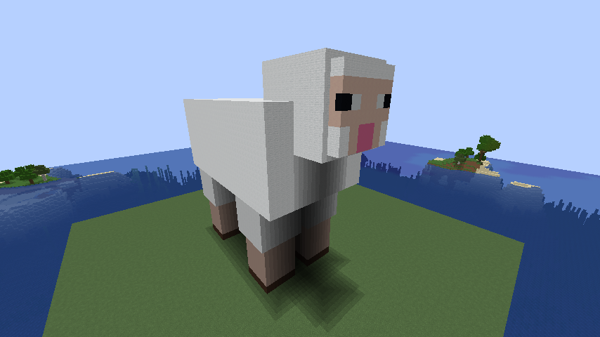

SHEEP_APIの取扱説明書
- 初めに、import sheep_api as saと入れることで使えるようになります。
- 使用できる構文は
  spawn・・・・・羊をスポーンさせます。
  despawn・・・・羊をデスポーンさせます。
  の2つです。
- sheep_api.pyをそのまま実行すると、羊がスポーンし、3秒後にデスポーンします。
- reset.pyを実行すると、羊の出現場所（初期設定）から半径50ブロックを海面の高さに合わせて整地し、土台を作ります。
- sheep_apiの他のファイルでの使い方はsheep.pyを参考にしてください。

